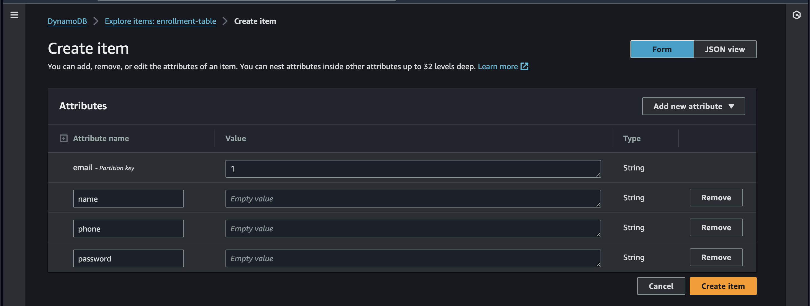

# AWS Serverless Enrollment Form

This project enables users to fill out a form online and securely submit their information. 

The submitted data is stored in an Amazon DynamoDB table for further processing. 

This README provides an overview of the project, setup instructions, usage guidelines, and more.

# Benefits:

Scalability: Serverless architecture scales automatically to handle high volumes of enrollment requests.

Reduced Costs: Pay only for the resources you use, eliminating server management costs.

Fast Deployment: Deploy your enrollment form quickly and easily with pre-configured AWS resources.

Secure Data Storage: Leverage DynamoDB for secure and reliable storage of enrollment data.

# Features:
Simple and intuitive web form interface.

Serverless architecture for scalability and cost-effectiveness.

Secure storage of user data in DynamoDB.

Easy deployment and integration with AWS services.

# Setup:

Follow these steps to set up the AWS Serverless Enrollment Form project:

# 1. DynamoDB Table
Create a DynamoDB table to store the submitted form data. 

keep every settings default and create a DynamoDB Table

Define the necessary attributes to capture user information such as name, email, and phone number.

# 2. IAM Role
Create an IAM role with permissions to access DynamoDB and CloudWatch. 

Attach the IAM role to the Lambda function to enable interaction with DynamoDB and Cloudwatch.

# 3. Lambda Function
Deploy the provided Python code (lambda_function.py) as a Lambda function in your AWS environment. 

Ensure that the function has the necessary permissions to read from and write to DynamoDB.

# 4. API Gateway
Set up an API Gateway to serve as a trigger for the Lambda function. 

Configure endpoints for form submission and enable CORS to allow cross-origin requests from the frontend.

# 5. Frontend Deployment
Host the provided HTML, CSS, and JavaScript files (index.html, styles.css, script.js) on a web server or a serverless hosting platform like AWS S3. 

Update the API endpoint URLs in the JavaScript file to match your API Gateway endpoints.

# 6. Data stored in DynamoDB-Table (final result)

Data entered in frontend

Data In DynamoDB-Table

# Usage:

Users can access the enrollment form through the provided HTML interface (index.html). 

They can input their details and submit the form, triggering the Lambda function via API Gateway. 

The Lambda function processes the data and stores it securely in the DynamoDB table.

# Further Resources:

AWS DynamoDB: https://docs.aws.amazon.com/amazondynamodb/latest/developerguide/Introduction.html

AWS IAM Roles: https://docs.aws.amazon.com/IAM/latest/UserGuide/id_roles.html

AWS Lambda: https://aws.amazon.com/lambda/

AWS API Gateway: https://docs.aws.amazon.com/apigateway/latest/developerguide/welcome.html

CORS: https://addons.mozilla.org/en-US/firefox/addon/access-control-allow-origin/

